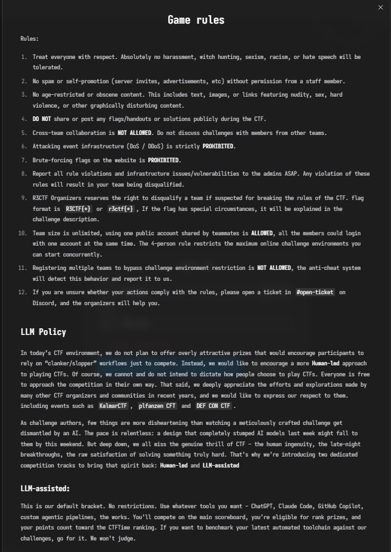
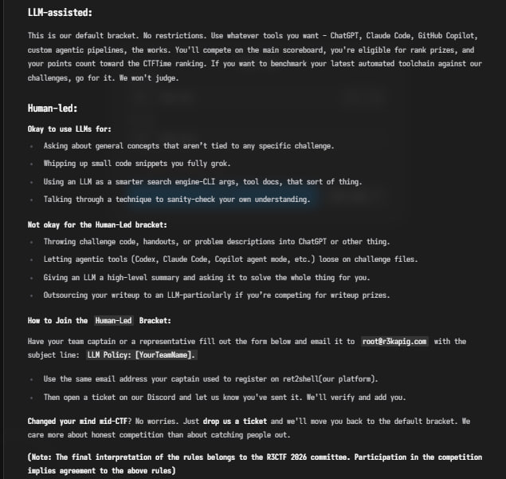

The flag format is specified as R3CTF{...} or r3ctf{...}, and team sizes are unlimited.

 

Rules:
1. Treat everyone with respect. Absolutely no harassment, witch hunting, sexism, racism, or hate speech will be tolerated.
2. No spam or self-promotion (server invites, advertisements, etc) without permission from a staff member.
3. No age-restricted or obscene content. This includes text, images, or links featuring nudity, sex, hard violence, or other graphically disturbing content.
4. **DO NOT** share or post any flags/handouts or solutions publicly during the CTF.
5. Cross-team collaboration is **NOT ALLOWED**. Do not discuss challenges with members from other teams.
6. Attacking event infrastructure (DoS / DDoS) is strictly **PROHIBITED**.
7. Brute-forcing flags on the website is **PROHIBITED**.
8. Report all rule violations and infrastructure issues/vulnerabilities to the admins ASAP. Any violation of these rules will result in your team being disqualified.
9. R3CTF Organizers reserves the right to disqualify a team if suspected for breaking the rules of the CTF.
10. flag format is `R3CTF{*}` or `r3ctf{*}`,If the flag has special circumstances, it will be explained in the challenge description.
11. Team size is unlimited, using one public account shared by teammates is **ALLOWED**, all the members could login with one account at the same time. The 4-person rule restricts the maximum online challenge environments you can start concurrently.
12. Registering multiple teams to bypass challenge environment restriction is **NOT ALLOWED**, the anti-cheat system will detect this behavior and report it to us.
13. If you are unsure whether your actions comply with the rules, please open a ticket in <#1247863186980605953> on Discord, and the organizers will help you.
14. In today’s CTF environment, we do not plan to offer overly attractive prizes that would encourage participants to rely on “clanker/slopper” workflows just to compete. Instead, we would like to encourage a more `low-LLM` approach to playing CTFs. Of course, we cannot and do not intend to dictate how people choose to play CTFs. Everyone is free to approach the competition in their own way. That said, we deeply appreciate the efforts and explorations made by many other CTF organizers and communities in recent years, and we would like to express our respect to them. including events such as  `Kalmar CTF`, `plfanzen CFT` and `DEF CON CTF`.

**(Note: The final interpretation of the rules belongs to the R3CTF 2026 committee. Participation in the competition implies agreement to the above rules)**

Categories: Web, Crypto, Pwn, Reverse, Misc, Forensics, BlockChain etc.

Hey @everyone here is our llm policy of r3ctf 2026

In today’s CTF environment, we do not plan to offer overly attractive prizes that would encourage participants to rely on “clanker/slopper” workflows just to compete. Instead, we would like to encourage a more **Human-led** approach to playing CTFs. Of course, we cannot and do not intend to dictate how people choose to play CTFs. Everyone is free to approach the competition in their own way. That said, we deeply appreciate the efforts and explorations made by many other CTF organizers and communities in recent years, and we would like to express our respect to them. including events such as  `KalmarCTF`, `plfanzen CFT` and `DEF CON CTF`.

As challenge authors, few things are more disheartening than watching a meticulously crafted challenge get dismantled by an AI. The pace is relentless: a design that completely stumped AI models last week might fall to them by this weekend. But deep down, we all miss the genuine thrill of CTF - the human ingenuity, the late-night breakthroughs, the raw satisfaction of solving something truly hard. That's why we're introducing two dedicated competition tracks to bring that spirit back: **Human-led** and **LLM-assisted**

## LLM-assisted:

This is our default bracket. No restrictions. Use whatever tools you want - ChatGPT, Claude Code, GitHub Copilot, custom agentic pipelines, the works. You'll compete on the main scoreboard, you're eligible for rank prizes, and your points count toward the CTFTime ranking. If you want to benchmark your latest automated toolchain against our challenges, go for it. We won't judge.

## Human-led:

### ✅ Okay to use LLMs for:
- Asking about general concepts that aren’t tied to any specific challenge.
- Whipping up small code snippets you fully grok.
- Using an LLM as a smarter search engine-CLI args, tool docs, that sort of thing.
- Talking through a technique to sanity-check your own understanding.

### ❌ Not okay for the Human-Led bracket:
- Throwing challenge code, handouts, or problem descriptions into ChatGPT or other thing.
- Letting agentic tools (Codex, Claude Code, Copilot agent mode, etc.) loose on challenge files.
- Giving an LLM a high-level summary and asking it to solve the whole thing for you.
- Outsourcing your writeup to an LLM-particularly if you’re competing for writeup prizes.

## How to Join the `Human-Led` Bracket:

Have your team captain or a representative fill out the form below and email it to `root@r3kapig.com` with the subject line: `LLM Policy: [YourTeamName].`

- Use the same email address your captain used to register on ret2shell(our platform).
- Then open a ticket on our Discord and let us know you've sent it. We'll verify and add you.

**Changed your mind mid-CTF**? No worries. Just **drop us a ticket** and we'll move you back to the default bracket. We care more about honest competition than about catching people out.

Most of all, play R3CTF's final Jeopardy your way. We'd also like to thank `KalmarCTF 2026` and `plfanzen CTF 2026` for their pioneering work on LLM policies that helped pave the way for ours. <:blobheart:1362642910419619881>  Above all, we hope everyone could enjoy this game! 🔥